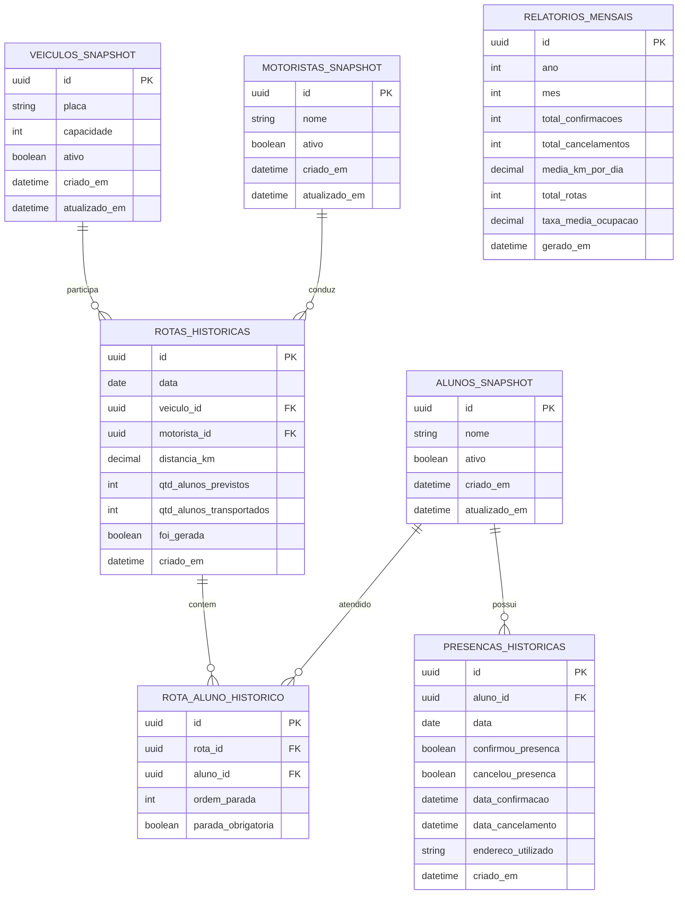

```mermaid
classDiagram
direction TB

class RelatorioMensalController {
  +GetRelatorioMensal(ano, mes)
  +GetFrequenciaAluno(alunoId, ano, mes)
  +GetMediaKmPorDia(ano, mes)
  +GetIndicadoresOperacionais(ano, mes)
}

class RelatorioMensalService {
  +GerarRelatorioMensal(ano, mes) RelatorioMensalDto
  +CalcularFrequenciaAluno(alunoId, ano, mes) FrequenciaAlunoDto
  +CalcularMediaKmPorDia(ano, mes) decimal
  +ObterIndicadoresOperacionais(ano, mes) IndicadorOperacionalDto
}

class SyncHistoricoService {
  +ImportarPresencas(inicio, fim)
  +ImportarRotas(inicio, fim)
  +ImportarAlunos()
  +ImportarVeiculos()
  +ImportarMotoristas()
}

class PresencaHistorica {
  +Guid Id
  +Guid AlunoId
  +DateOnly Data
  +bool ConfirmouPresenca
  +bool CancelouPresenca
  +DateTime DataConfirmacao
  +DateTime DataCancelamento
  +string EnderecoUtilizado
}

class RotaHistorica {
  +Guid Id
  +DateOnly Data
  +Guid VeiculoId
  +Guid MotoristaId
  +decimal DistanciaKm
  +int QuantidadeAlunosPrevistos
  +int QuantidadeAlunosTransportados
  +bool FoiGerada
}

class AlunoSnapshot {
  +Guid Id
  +string Nome
  +bool Ativo
}

class VeiculoSnapshot {
  +Guid Id
  +string Placa
  +int Capacidade
  +bool Ativo
}

class MotoristaSnapshot {
  +Guid Id
  +string Nome
  +bool Ativo
}

class RelatorioMensalDto {
  +int Ano
  +int Mes
  +int TotalConfirmacoes
  +int TotalCancelamentos
  +decimal MediaKmPorDia
  +int TotalRotas
}

class FrequenciaAlunoDto {
  +Guid AlunoId
  +string NomeAluno
  +int DiasConfirmados
  +int DiasCancelados
  +decimal PercentualFrequencia
}

class IndicadorOperacionalDto {
  +decimal MediaKmPorDia
  +decimal TaxaMediaOcupacao
  +int TotalRotasPeriodo
  +int TotalPresencasConfirmadas
  +int TotalCancelamentos
}

class IPresencaHistoricaRepository {
  <<interface>>
  +ObterPorPeriodo(inicio, fim)
  +ObterPorAluno(alunoId, inicio, fim)
}

class IRotaHistoricaRepository {
  <<interface>>
  +ObterPorPeriodo(inicio, fim)
}

class IAlunoSnapshotRepository {
  <<interface>>
  +ObterPorId(alunoId)
  +ObterTodos()
}

class IPresencaServiceClient {
  <<interface>>
  +ObterHistorico(inicio, fim)
}

class IRoteirizacaoServiceClient {
  <<interface>>
  +ObterRotas(inicio, fim)
}

class IAdministrativoServiceClient {
  <<interface>>
  +ObterAlunos()
  +ObterVeiculos()
  +ObterMotoristas()
}

RelatorioMensalController --> RelatorioMensalService
RelatorioMensalService --> IPresencaHistoricaRepository
RelatorioMensalService --> IRotaHistoricaRepository
RelatorioMensalService --> IAlunoSnapshotRepository

SyncHistoricoService --> IPresencaServiceClient
SyncHistoricoService --> IRoteirizacaoServiceClient
SyncHistoricoService --> IAdministrativoServiceClient
SyncHistoricoService --> IPresencaHistoricaRepository
SyncHistoricoService --> IRotaHistoricaRepository
SyncHistoricoService --> IAlunoSnapshotRepository

RelatorioMensalService ..> RelatorioMensalDto
RelatorioMensalService ..> FrequenciaAlunoDto
RelatorioMensalService ..> IndicadorOperacionalDto

PresencaHistorica --> AlunoSnapshot : pertence a
RotaHistorica --> VeiculoSnapshot : usa
RotaHistorica --> MotoristaSnapshot : executada por
```

```mermaid
erDiagram
    ALUNOS_SNAPSHOT {
        uuid id PK
        string nome
        boolean ativo
        datetime criado_em
        datetime atualizado_em
    }

    VEICULOS_SNAPSHOT {
        uuid id PK
        string placa
        int capacidade
        boolean ativo
        datetime criado_em
        datetime atualizado_em
    }

    MOTORISTAS_SNAPSHOT {
        uuid id PK
        string nome
        boolean ativo
        datetime criado_em
        datetime atualizado_em
    }

    PRESENCAS_HISTORICAS {
        uuid id PK
        uuid aluno_id FK
        date data
        boolean confirmou_presenca
        boolean cancelou_presenca
        datetime data_confirmacao
        datetime data_cancelamento
        string endereco_utilizado
        datetime criado_em
    }

    ROTAS_HISTORICAS {
        uuid id PK
        date data
        uuid veiculo_id FK
        uuid motorista_id FK
        decimal distancia_km
        int qtd_alunos_previstos
        int qtd_alunos_transportados
        boolean foi_gerada
        datetime criado_em
    }

    ROTA_ALUNO_HISTORICO {
        uuid id PK
        uuid rota_id FK
        uuid aluno_id FK
        int ordem_parada
        boolean parada_obrigatoria
    }

    RELATORIOS_MENSAIS {
        uuid id PK
        int ano
        int mes
        int total_confirmacoes
        int total_cancelamentos
        decimal media_km_por_dia
        int total_rotas
        decimal taxa_media_ocupacao
        datetime gerado_em
    }

    ALUNOS_SNAPSHOT ||--o{ PRESENCAS_HISTORICAS : possui
    VEICULOS_SNAPSHOT ||--o{ ROTAS_HISTORICAS : participa
    MOTORISTAS_SNAPSHOT ||--o{ ROTAS_HISTORICAS : conduz
    ROTAS_HISTORICAS ||--o{ ROTA_ALUNO_HISTORICO : contem
    ALUNOS_SNAPSHOT ||--o{ ROTA_ALUNO_HISTORICO : atendido
```
